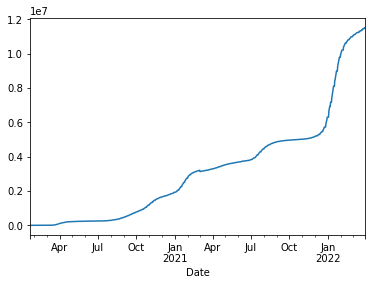
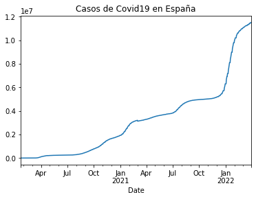
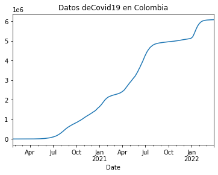
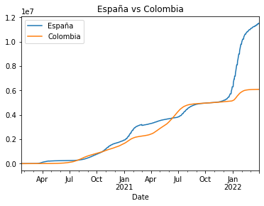
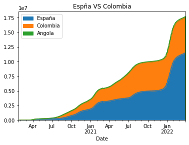
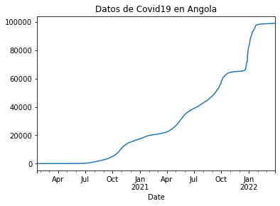
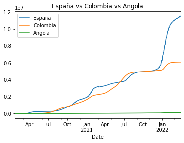
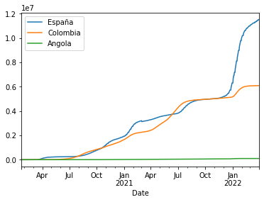

# Uso de API de Covid19 con Pandas

https://api.covid19api.com/

https://api.covid19api.com

## Instalación Pandas


```python
!pip install pandas
```

    Requirement already satisfied: pandas in c:\programdata\anaconda3\lib\site-packages (1.2.4)
    Requirement already satisfied: numpy>=1.16.5 in c:\programdata\anaconda3\lib\site-packages (from pandas) (1.20.1)
    Requirement already satisfied: python-dateutil>=2.7.3 in c:\programdata\anaconda3\lib\site-packages (from pandas) (2.8.1)
    Requirement already satisfied: pytz>=2017.3 in c:\programdata\anaconda3\lib\site-packages (from pandas) (2021.1)
    Requirement already satisfied: six>=1.5 in c:\programdata\anaconda3\lib\site-packages (from python-dateutil>=2.7.3->pandas) (1.15.0)
    

## Configuración


```python
import pandas as pd
```

## Variables
El segundo paso es definir las variables.

Ante todo, lo primero que se indica es la URL de donde queremos sacar los datos ("https://api.covid19api.com/countries")


```python
url = 'https://api.covid19api.com/countries'
```

## Creación de *dataframe*
Utilizamos la función `read_json` para leer los datos en JSON dela API.
Después, usaremos el DataFrame (tabla) para organizarlos


```python
df = pd.read_json(url)
```


```python
df
```


<div>
<style scoped>
    .dataframe tbody tr th:only-of-type {
        vertical-align: middle;
    }

    .dataframe tbody tr th {
        vertical-align: top;
    }

    .dataframe thead th {
        text-align: right;
    }
</style>
<table border="1" class="dataframe">
  <thead>
    <tr style="text-align: right;">
      <th></th>
      <th>Country</th>
      <th>Slug</th>
      <th>ISO2</th>
    </tr>
  </thead>
  <tbody>
    <tr>
      <th>0</th>
      <td>Republic of Kosovo</td>
      <td>kosovo</td>
      <td>XK</td>
    </tr>
    <tr>
      <th>1</th>
      <td>Botswana</td>
      <td>botswana</td>
      <td>BW</td>
    </tr>
    <tr>
      <th>2</th>
      <td>Central African Republic</td>
      <td>central-african-republic</td>
      <td>CF</td>
    </tr>
    <tr>
      <th>3</th>
      <td>Hungary</td>
      <td>hungary</td>
      <td>HU</td>
    </tr>
    <tr>
      <th>4</th>
      <td>Peru</td>
      <td>peru</td>
      <td>PE</td>
    </tr>
    <tr>
      <th>...</th>
      <td>...</td>
      <td>...</td>
      <td>...</td>
    </tr>
    <tr>
      <th>243</th>
      <td>Malta</td>
      <td>malta</td>
      <td>MT</td>
    </tr>
    <tr>
      <th>244</th>
      <td>San Marino</td>
      <td>san-marino</td>
      <td>SM</td>
    </tr>
    <tr>
      <th>245</th>
      <td>Gibraltar</td>
      <td>gibraltar</td>
      <td>GI</td>
    </tr>
    <tr>
      <th>246</th>
      <td>Uganda</td>
      <td>uganda</td>
      <td>UG</td>
    </tr>
    <tr>
      <th>247</th>
      <td>Vanuatu</td>
      <td>vanuatu</td>
      <td>VU</td>
    </tr>
  </tbody>
</table>
<p>248 rows × 3 columns</p>
</div>


## Explorar tabla
Para navegar por los datos de la tabla escogemos estas tres características:
- Cabecera
- Cola
- Descripción
En el código, el número de filas que queremos vanalizar va entre paréntesis. Si no se rellena el paréntesis con ningñún dato , automáticamente, el programa nos da 5 valores, en la cabeza (head)y en la cola (tail).


```python
df.head()
```


<div>
<style scoped>
    .dataframe tbody tr th:only-of-type {
        vertical-align: middle;
    }

    .dataframe tbody tr th {
        vertical-align: top;
    }

    .dataframe thead th {
        text-align: right;
    }
</style>
<table border="1" class="dataframe">
  <thead>
    <tr style="text-align: right;">
      <th></th>
      <th>Country</th>
      <th>Slug</th>
      <th>ISO2</th>
    </tr>
  </thead>
  <tbody>
    <tr>
      <th>0</th>
      <td>Republic of Kosovo</td>
      <td>kosovo</td>
      <td>XK</td>
    </tr>
    <tr>
      <th>1</th>
      <td>Botswana</td>
      <td>botswana</td>
      <td>BW</td>
    </tr>
    <tr>
      <th>2</th>
      <td>Central African Republic</td>
      <td>central-african-republic</td>
      <td>CF</td>
    </tr>
    <tr>
      <th>3</th>
      <td>Hungary</td>
      <td>hungary</td>
      <td>HU</td>
    </tr>
    <tr>
      <th>4</th>
      <td>Peru</td>
      <td>peru</td>
      <td>PE</td>
    </tr>
  </tbody>
</table>
</div>


```python
df.tail()
```


<div>
<style scoped>
    .dataframe tbody tr th:only-of-type {
        vertical-align: middle;
    }

    .dataframe tbody tr th {
        vertical-align: top;
    }

    .dataframe thead th {
        text-align: right;
    }
</style>
<table border="1" class="dataframe">
  <thead>
    <tr style="text-align: right;">
      <th></th>
      <th>Country</th>
      <th>Slug</th>
      <th>ISO2</th>
    </tr>
  </thead>
  <tbody>
    <tr>
      <th>243</th>
      <td>Malta</td>
      <td>malta</td>
      <td>MT</td>
    </tr>
    <tr>
      <th>244</th>
      <td>San Marino</td>
      <td>san-marino</td>
      <td>SM</td>
    </tr>
    <tr>
      <th>245</th>
      <td>Gibraltar</td>
      <td>gibraltar</td>
      <td>GI</td>
    </tr>
    <tr>
      <th>246</th>
      <td>Uganda</td>
      <td>uganda</td>
      <td>UG</td>
    </tr>
    <tr>
      <th>247</th>
      <td>Vanuatu</td>
      <td>vanuatu</td>
      <td>VU</td>
    </tr>
  </tbody>
</table>
</div>


En la descripción (describe) sirve para una descripción numérica de la tabla en cuestión


```python
df.describe()
```


<div>
<style scoped>
    .dataframe tbody tr th:only-of-type {
        vertical-align: middle;
    }

    .dataframe tbody tr th {
        vertical-align: top;
    }

    .dataframe thead th {
        text-align: right;
    }
</style>
<table border="1" class="dataframe">
  <thead>
    <tr style="text-align: right;">
      <th></th>
      <th>Country</th>
      <th>Slug</th>
      <th>ISO2</th>
    </tr>
  </thead>
  <tbody>
    <tr>
      <th>count</th>
      <td>248</td>
      <td>248</td>
      <td>248</td>
    </tr>
    <tr>
      <th>unique</th>
      <td>248</td>
      <td>248</td>
      <td>248</td>
    </tr>
    <tr>
      <th>top</th>
      <td>Tanzania, United Republic of</td>
      <td>kuwait</td>
      <td>KE</td>
    </tr>
    <tr>
      <th>freq</th>
      <td>1</td>
      <td>1</td>
      <td>1</td>
    </tr>
  </tbody>
</table>
</div>


(info)te da un resumen del dataframe. Se suele usar paa saber que no hay celdas vacías


```python
df.info()
```

    <class 'pandas.core.frame.DataFrame'>
    RangeIndex: 248 entries, 0 to 247
    Data columns (total 3 columns):
     #   Column   Non-Null Count  Dtype 
    ---  ------   --------------  ----- 
     0   Country  248 non-null    object
     1   Slug     248 non-null    object
     2   ISO2     248 non-null    object
    dtypes: object(3)
    memory usage: 5.9+ KB
    

## Acceso a datos
Si quisiéramos ver solo una de las columnas, hay que seleccionar entre corchetes la columna que queremos conseguir. Asimismo nos dará un extracto, de los primeros y los últimos de la lista


```python
df['Country']
```


    0            Republic of Kosovo
    1                      Botswana
    2      Central African Republic
    3                       Hungary
    4                          Peru
                     ...           
    243                       Malta
    244                  San Marino
    245                   Gibraltar
    246                      Uganda
    247                     Vanuatu
    Name: Country, Length: 248, dtype: object


Para saber un valor en concreto de dentro de la columna escogida, en este caso, Country, se coloca el valor que quieres entre corchetes


```python
df['Country'][200]
```


    'Angola'


## Tiempo real España

Para saber los datos en tiempo real se usa el código url_es, como en el ejemplo de abajo para ver los datos en tiempo real de España en este caso. Ahora, creamos un DataFrame que lo nombraremos como df_es 
Debajo, ponemos el DataFrame para comprobar si se ha realizado correctamente


```python
url_es = 'https://api.covid19api.com/country/spain/status/confirmed/live'
df_es = pd.read_json(url_es)
df_es
```


<div>
<style scoped>
    .dataframe tbody tr th:only-of-type {
        vertical-align: middle;
    }

    .dataframe tbody tr th {
        vertical-align: top;
    }

    .dataframe thead th {
        text-align: right;
    }
</style>
<table border="1" class="dataframe">
  <thead>
    <tr style="text-align: right;">
      <th></th>
      <th>Country</th>
      <th>CountryCode</th>
      <th>Province</th>
      <th>City</th>
      <th>CityCode</th>
      <th>Lat</th>
      <th>Lon</th>
      <th>Cases</th>
      <th>Status</th>
      <th>Date</th>
    </tr>
  </thead>
  <tbody>
    <tr>
      <th>0</th>
      <td>Spain</td>
      <td>ES</td>
      <td></td>
      <td></td>
      <td></td>
      <td>40.46</td>
      <td>-3.75</td>
      <td>0</td>
      <td>confirmed</td>
      <td>2020-01-22 00:00:00+00:00</td>
    </tr>
    <tr>
      <th>1</th>
      <td>Spain</td>
      <td>ES</td>
      <td></td>
      <td></td>
      <td></td>
      <td>40.46</td>
      <td>-3.75</td>
      <td>0</td>
      <td>confirmed</td>
      <td>2020-01-23 00:00:00+00:00</td>
    </tr>
    <tr>
      <th>2</th>
      <td>Spain</td>
      <td>ES</td>
      <td></td>
      <td></td>
      <td></td>
      <td>40.46</td>
      <td>-3.75</td>
      <td>0</td>
      <td>confirmed</td>
      <td>2020-01-24 00:00:00+00:00</td>
    </tr>
    <tr>
      <th>3</th>
      <td>Spain</td>
      <td>ES</td>
      <td></td>
      <td></td>
      <td></td>
      <td>40.46</td>
      <td>-3.75</td>
      <td>0</td>
      <td>confirmed</td>
      <td>2020-01-25 00:00:00+00:00</td>
    </tr>
    <tr>
      <th>4</th>
      <td>Spain</td>
      <td>ES</td>
      <td></td>
      <td></td>
      <td></td>
      <td>40.46</td>
      <td>-3.75</td>
      <td>0</td>
      <td>confirmed</td>
      <td>2020-01-26 00:00:00+00:00</td>
    </tr>
    <tr>
      <th>...</th>
      <td>...</td>
      <td>...</td>
      <td>...</td>
      <td>...</td>
      <td>...</td>
      <td>...</td>
      <td>...</td>
      <td>...</td>
      <td>...</td>
      <td>...</td>
    </tr>
    <tr>
      <th>794</th>
      <td>Spain</td>
      <td>ES</td>
      <td></td>
      <td></td>
      <td></td>
      <td>40.46</td>
      <td>-3.75</td>
      <td>11451676</td>
      <td>confirmed</td>
      <td>2022-03-26 00:00:00+00:00</td>
    </tr>
    <tr>
      <th>795</th>
      <td>Spain</td>
      <td>ES</td>
      <td></td>
      <td></td>
      <td></td>
      <td>40.46</td>
      <td>-3.75</td>
      <td>11451676</td>
      <td>confirmed</td>
      <td>2022-03-27 00:00:00+00:00</td>
    </tr>
    <tr>
      <th>796</th>
      <td>Spain</td>
      <td>ES</td>
      <td></td>
      <td></td>
      <td></td>
      <td>40.46</td>
      <td>-3.75</td>
      <td>11451676</td>
      <td>confirmed</td>
      <td>2022-03-28 00:00:00+00:00</td>
    </tr>
    <tr>
      <th>797</th>
      <td>Spain</td>
      <td>ES</td>
      <td></td>
      <td></td>
      <td></td>
      <td>40.46</td>
      <td>-3.75</td>
      <td>11508309</td>
      <td>confirmed</td>
      <td>2022-03-29 00:00:00+00:00</td>
    </tr>
    <tr>
      <th>798</th>
      <td>Spain</td>
      <td>ES</td>
      <td></td>
      <td></td>
      <td></td>
      <td>40.46</td>
      <td>-3.75</td>
      <td>11508309</td>
      <td>confirmed</td>
      <td>2022-03-30 00:00:00+00:00</td>
    </tr>
  </tbody>
</table>
<p>799 rows × 10 columns</p>
</div>


Luego ponemos df_es.info para que obtener toda la información de la tabla referenciada


```python
df_es.info()
```

    <class 'pandas.core.frame.DataFrame'>
    RangeIndex: 799 entries, 0 to 798
    Data columns (total 10 columns):
     #   Column       Non-Null Count  Dtype              
    ---  ------       --------------  -----              
     0   Country      799 non-null    object             
     1   CountryCode  799 non-null    object             
     2   Province     799 non-null    object             
     3   City         799 non-null    object             
     4   CityCode     799 non-null    object             
     5   Lat          799 non-null    float64            
     6   Lon          799 non-null    float64            
     7   Cases        799 non-null    int64              
     8   Status       799 non-null    object             
     9   Date         799 non-null    datetime64[ns, UTC]
    dtypes: datetime64[ns, UTC](1), float64(2), int64(1), object(6)
    memory usage: 62.5+ KB
    

Si queremos que la columna tenga columnas en específico y que empiece por un valor se escribe a continuación entre corchetes. En este caso, queremos que empiece por las fechas y con los casos:


```python
df_es.set_index('Date')
```


<div>
<style scoped>
    .dataframe tbody tr th:only-of-type {
        vertical-align: middle;
    }

    .dataframe tbody tr th {
        vertical-align: top;
    }

    .dataframe thead th {
        text-align: right;
    }
</style>
<table border="1" class="dataframe">
  <thead>
    <tr style="text-align: right;">
      <th></th>
      <th>Country</th>
      <th>CountryCode</th>
      <th>Province</th>
      <th>City</th>
      <th>CityCode</th>
      <th>Lat</th>
      <th>Lon</th>
      <th>Cases</th>
      <th>Status</th>
    </tr>
    <tr>
      <th>Date</th>
      <th></th>
      <th></th>
      <th></th>
      <th></th>
      <th></th>
      <th></th>
      <th></th>
      <th></th>
      <th></th>
    </tr>
  </thead>
  <tbody>
    <tr>
      <th>2020-01-22 00:00:00+00:00</th>
      <td>Spain</td>
      <td>ES</td>
      <td></td>
      <td></td>
      <td></td>
      <td>40.46</td>
      <td>-3.75</td>
      <td>0</td>
      <td>confirmed</td>
    </tr>
    <tr>
      <th>2020-01-23 00:00:00+00:00</th>
      <td>Spain</td>
      <td>ES</td>
      <td></td>
      <td></td>
      <td></td>
      <td>40.46</td>
      <td>-3.75</td>
      <td>0</td>
      <td>confirmed</td>
    </tr>
    <tr>
      <th>2020-01-24 00:00:00+00:00</th>
      <td>Spain</td>
      <td>ES</td>
      <td></td>
      <td></td>
      <td></td>
      <td>40.46</td>
      <td>-3.75</td>
      <td>0</td>
      <td>confirmed</td>
    </tr>
    <tr>
      <th>2020-01-25 00:00:00+00:00</th>
      <td>Spain</td>
      <td>ES</td>
      <td></td>
      <td></td>
      <td></td>
      <td>40.46</td>
      <td>-3.75</td>
      <td>0</td>
      <td>confirmed</td>
    </tr>
    <tr>
      <th>2020-01-26 00:00:00+00:00</th>
      <td>Spain</td>
      <td>ES</td>
      <td></td>
      <td></td>
      <td></td>
      <td>40.46</td>
      <td>-3.75</td>
      <td>0</td>
      <td>confirmed</td>
    </tr>
    <tr>
      <th>...</th>
      <td>...</td>
      <td>...</td>
      <td>...</td>
      <td>...</td>
      <td>...</td>
      <td>...</td>
      <td>...</td>
      <td>...</td>
      <td>...</td>
    </tr>
    <tr>
      <th>2022-03-26 00:00:00+00:00</th>
      <td>Spain</td>
      <td>ES</td>
      <td></td>
      <td></td>
      <td></td>
      <td>40.46</td>
      <td>-3.75</td>
      <td>11451676</td>
      <td>confirmed</td>
    </tr>
    <tr>
      <th>2022-03-27 00:00:00+00:00</th>
      <td>Spain</td>
      <td>ES</td>
      <td></td>
      <td></td>
      <td></td>
      <td>40.46</td>
      <td>-3.75</td>
      <td>11451676</td>
      <td>confirmed</td>
    </tr>
    <tr>
      <th>2022-03-28 00:00:00+00:00</th>
      <td>Spain</td>
      <td>ES</td>
      <td></td>
      <td></td>
      <td></td>
      <td>40.46</td>
      <td>-3.75</td>
      <td>11451676</td>
      <td>confirmed</td>
    </tr>
    <tr>
      <th>2022-03-29 00:00:00+00:00</th>
      <td>Spain</td>
      <td>ES</td>
      <td></td>
      <td></td>
      <td></td>
      <td>40.46</td>
      <td>-3.75</td>
      <td>11508309</td>
      <td>confirmed</td>
    </tr>
    <tr>
      <th>2022-03-30 00:00:00+00:00</th>
      <td>Spain</td>
      <td>ES</td>
      <td></td>
      <td></td>
      <td></td>
      <td>40.46</td>
      <td>-3.75</td>
      <td>11508309</td>
      <td>confirmed</td>
    </tr>
  </tbody>
</table>
<p>799 rows × 9 columns</p>
</div>


```python
df_es.set_index('Date')['Cases']
```


    Date
    2020-01-22 00:00:00+00:00           0
    2020-01-23 00:00:00+00:00           0
    2020-01-24 00:00:00+00:00           0
    2020-01-25 00:00:00+00:00           0
    2020-01-26 00:00:00+00:00           0
                                   ...   
    2022-03-26 00:00:00+00:00    11451676
    2022-03-27 00:00:00+00:00    11451676
    2022-03-28 00:00:00+00:00    11451676
    2022-03-29 00:00:00+00:00    11508309
    2022-03-30 00:00:00+00:00    11508309
    Name: Cases, Length: 799, dtype: int64


Para crear una gráfica con los datos correspondientes, usaremos la siguiente fórmula: df_es.set_index ('Date') ['Cases'].plot()


```python
df_es.set_index('Date')['Cases'].plot()
```


    <AxesSubplot:xlabel='Date'>


    

    


El paréntsis tiene varias funciones, entre ellas tittle para titular la tabla


```python
df_es.set_index('Date')['Cases'].plot(title="Casos de Covid19 en España")
```


    <AxesSubplot:title={'center':'Casos de Covid19 en España'}, xlabel='Date'>


    

    


## Tiempo real Colombia
Realizamos lo mismo que con los datos de España, cambiando 'es' por 'co' en las urls, porque es lo que correponde a Colombia


```python
url_co = 'https://api.covid19api.com/country/colombia/status/confirmed/live'
df_co = pd.read_json(url_co)
df_co.set_index('Date')['Cases'].plot(title="Datos deCovid19 en Colombia")
```


    <AxesSubplot:title={'center':'Datos deCovid19 en Colombia'}, xlabel='Date'>


    

    


## Comparativa España-Colombia

Para tener un gráfico en el que se compare los datos juntos de ambos países se indican: Casos españa = fórmula enterior Casos Colombia= fórmula anterior y lo ejecutamos


```python
casos_es = df_es.set_index('Date')['Cases']
casos_co = df_co.set_index('Date')['Cases']
```

Empleamos una nueva función de Pandas que se llama concatenar. Con esta función le decimos que nos una y compare las dos estadísticas anteriores y marcamos que nos la ponga en el eje axis 1, para que nos lo coloque a la derecha


```python
casos_es
```


    Date
    2020-01-22 00:00:00+00:00           0
    2020-01-23 00:00:00+00:00           0
    2020-01-24 00:00:00+00:00           0
    2020-01-25 00:00:00+00:00           0
    2020-01-26 00:00:00+00:00           0
                                   ...   
    2022-03-26 00:00:00+00:00    11451676
    2022-03-27 00:00:00+00:00    11451676
    2022-03-28 00:00:00+00:00    11451676
    2022-03-29 00:00:00+00:00    11508309
    2022-03-30 00:00:00+00:00    11508309
    Name: Cases, Length: 799, dtype: int64


```python
pd.concat([casos_es,casos_co])
```


    Date
    2020-01-22 00:00:00+00:00          0
    2020-01-23 00:00:00+00:00          0
    2020-01-24 00:00:00+00:00          0
    2020-01-25 00:00:00+00:00          0
    2020-01-26 00:00:00+00:00          0
                                  ...   
    2022-03-26 00:00:00+00:00    6083291
    2022-03-27 00:00:00+00:00    6083643
    2022-03-28 00:00:00+00:00    6083939
    2022-03-29 00:00:00+00:00    6084240
    2022-03-30 00:00:00+00:00    6084551
    Name: Cases, Length: 1598, dtype: int64


```python
pd.concat([casos_es,casos_co],axis=1)
```


<div>
<style scoped>
    .dataframe tbody tr th:only-of-type {
        vertical-align: middle;
    }

    .dataframe tbody tr th {
        vertical-align: top;
    }

    .dataframe thead th {
        text-align: right;
    }
</style>
<table border="1" class="dataframe">
  <thead>
    <tr style="text-align: right;">
      <th></th>
      <th>Cases</th>
      <th>Cases</th>
    </tr>
    <tr>
      <th>Date</th>
      <th></th>
      <th></th>
    </tr>
  </thead>
  <tbody>
    <tr>
      <th>2020-01-22 00:00:00+00:00</th>
      <td>0</td>
      <td>0</td>
    </tr>
    <tr>
      <th>2020-01-23 00:00:00+00:00</th>
      <td>0</td>
      <td>0</td>
    </tr>
    <tr>
      <th>2020-01-24 00:00:00+00:00</th>
      <td>0</td>
      <td>0</td>
    </tr>
    <tr>
      <th>2020-01-25 00:00:00+00:00</th>
      <td>0</td>
      <td>0</td>
    </tr>
    <tr>
      <th>2020-01-26 00:00:00+00:00</th>
      <td>0</td>
      <td>0</td>
    </tr>
    <tr>
      <th>...</th>
      <td>...</td>
      <td>...</td>
    </tr>
    <tr>
      <th>2022-03-26 00:00:00+00:00</th>
      <td>11451676</td>
      <td>6083291</td>
    </tr>
    <tr>
      <th>2022-03-27 00:00:00+00:00</th>
      <td>11451676</td>
      <td>6083643</td>
    </tr>
    <tr>
      <th>2022-03-28 00:00:00+00:00</th>
      <td>11451676</td>
      <td>6083939</td>
    </tr>
    <tr>
      <th>2022-03-29 00:00:00+00:00</th>
      <td>11508309</td>
      <td>6084240</td>
    </tr>
    <tr>
      <th>2022-03-30 00:00:00+00:00</th>
      <td>11508309</td>
      <td>6084551</td>
    </tr>
  </tbody>
</table>
<p>799 rows × 2 columns</p>
</div>


```python
vs = pd.concat([casos_es,casos_co],axis=1)
vs
```


<div>
<style scoped>
    .dataframe tbody tr th:only-of-type {
        vertical-align: middle;
    }

    .dataframe tbody tr th {
        vertical-align: top;
    }

    .dataframe thead th {
        text-align: right;
    }
</style>
<table border="1" class="dataframe">
  <thead>
    <tr style="text-align: right;">
      <th></th>
      <th>Cases</th>
      <th>Cases</th>
    </tr>
    <tr>
      <th>Date</th>
      <th></th>
      <th></th>
    </tr>
  </thead>
  <tbody>
    <tr>
      <th>2020-01-22 00:00:00+00:00</th>
      <td>0</td>
      <td>0</td>
    </tr>
    <tr>
      <th>2020-01-23 00:00:00+00:00</th>
      <td>0</td>
      <td>0</td>
    </tr>
    <tr>
      <th>2020-01-24 00:00:00+00:00</th>
      <td>0</td>
      <td>0</td>
    </tr>
    <tr>
      <th>2020-01-25 00:00:00+00:00</th>
      <td>0</td>
      <td>0</td>
    </tr>
    <tr>
      <th>2020-01-26 00:00:00+00:00</th>
      <td>0</td>
      <td>0</td>
    </tr>
    <tr>
      <th>...</th>
      <td>...</td>
      <td>...</td>
    </tr>
    <tr>
      <th>2022-03-26 00:00:00+00:00</th>
      <td>11451676</td>
      <td>6083291</td>
    </tr>
    <tr>
      <th>2022-03-27 00:00:00+00:00</th>
      <td>11451676</td>
      <td>6083643</td>
    </tr>
    <tr>
      <th>2022-03-28 00:00:00+00:00</th>
      <td>11451676</td>
      <td>6083939</td>
    </tr>
    <tr>
      <th>2022-03-29 00:00:00+00:00</th>
      <td>11508309</td>
      <td>6084240</td>
    </tr>
    <tr>
      <th>2022-03-30 00:00:00+00:00</th>
      <td>11508309</td>
      <td>6084551</td>
    </tr>
  </tbody>
</table>
<p>799 rows × 2 columns</p>
</div>


Para cambiar el nombre de las columnas y que no se mencionen como casos lo hacemos de la misma manera, llamando las columnas con el nombre de los países en concreto, en este caso España y Colombia:


```python
vs.columns = ['España','Colombia']
vs
```


<div>
<style scoped>
    .dataframe tbody tr th:only-of-type {
        vertical-align: middle;
    }

    .dataframe tbody tr th {
        vertical-align: top;
    }

    .dataframe thead th {
        text-align: right;
    }
</style>
<table border="1" class="dataframe">
  <thead>
    <tr style="text-align: right;">
      <th></th>
      <th>España</th>
      <th>Colombia</th>
    </tr>
    <tr>
      <th>Date</th>
      <th></th>
      <th></th>
    </tr>
  </thead>
  <tbody>
    <tr>
      <th>2020-01-22 00:00:00+00:00</th>
      <td>0</td>
      <td>0</td>
    </tr>
    <tr>
      <th>2020-01-23 00:00:00+00:00</th>
      <td>0</td>
      <td>0</td>
    </tr>
    <tr>
      <th>2020-01-24 00:00:00+00:00</th>
      <td>0</td>
      <td>0</td>
    </tr>
    <tr>
      <th>2020-01-25 00:00:00+00:00</th>
      <td>0</td>
      <td>0</td>
    </tr>
    <tr>
      <th>2020-01-26 00:00:00+00:00</th>
      <td>0</td>
      <td>0</td>
    </tr>
    <tr>
      <th>...</th>
      <td>...</td>
      <td>...</td>
    </tr>
    <tr>
      <th>2022-03-26 00:00:00+00:00</th>
      <td>11451676</td>
      <td>6083291</td>
    </tr>
    <tr>
      <th>2022-03-27 00:00:00+00:00</th>
      <td>11451676</td>
      <td>6083643</td>
    </tr>
    <tr>
      <th>2022-03-28 00:00:00+00:00</th>
      <td>11451676</td>
      <td>6083939</td>
    </tr>
    <tr>
      <th>2022-03-29 00:00:00+00:00</th>
      <td>11508309</td>
      <td>6084240</td>
    </tr>
    <tr>
      <th>2022-03-30 00:00:00+00:00</th>
      <td>11508309</td>
      <td>6084551</td>
    </tr>
  </tbody>
</table>
<p>799 rows × 2 columns</p>
</div>


Para elaborar la gráfica hay usar el código vs.plot("x VS y") En nuestro caso, X es España e Y Colombia. Plot es lo que se menciona para obtener el gráfico


```python
vs.plot(title="España vs Colombia")
```


    <AxesSubplot:title={'center':'España vs Colombia'}, xlabel='Date'>


    

    


```python
vs.plot(title="Espña VS Colombia",kind='area')
```


    <AxesSubplot:title={'center':'Espña VS Colombia'}, xlabel='Date'>


    

    


## Tiempo real Angola
Igual que con españa y colombia., hacemos con Angola, que tiene como referencia an


```python
url_an = 'https://api.covid19api.com/country/angola/status/confirmed/live'
df_an = pd.read_json(url_an)
df_an.set_index('Date')['Cases'].plot(title="Datos de Covid19 en Angola")
```


    <AxesSubplot:title={'center':'Datos de Covid19 en Angola'}, xlabel='Date'>


    

    


## Triple Comparativa
hacemos una comparativa de los tres países realizados: España, Colombia y Angola, siguiendo los mismos pasos anteriores


```python
casos_es = df_es.set_index('Date')['Cases']
casos_co = df_co.set_index('Date')['Cases']
casos_an = df_an.set_index('Date')['Cases']
```


```python
casos_es
```


    Date
    2020-01-22 00:00:00+00:00           0
    2020-01-23 00:00:00+00:00           0
    2020-01-24 00:00:00+00:00           0
    2020-01-25 00:00:00+00:00           0
    2020-01-26 00:00:00+00:00           0
                                   ...   
    2022-03-26 00:00:00+00:00    11451676
    2022-03-27 00:00:00+00:00    11451676
    2022-03-28 00:00:00+00:00    11451676
    2022-03-29 00:00:00+00:00    11508309
    2022-03-30 00:00:00+00:00    11508309
    Name: Cases, Length: 799, dtype: int64


```python
pd.concat([casos_es,casos_co,casos_an])
```


    Date
    2020-01-22 00:00:00+00:00        0
    2020-01-23 00:00:00+00:00        0
    2020-01-24 00:00:00+00:00        0
    2020-01-25 00:00:00+00:00        0
    2020-01-26 00:00:00+00:00        0
                                 ...  
    2022-03-27 00:00:00+00:00    99115
    2022-03-28 00:00:00+00:00    99115
    2022-03-29 00:00:00+00:00    99138
    2022-03-30 00:00:00+00:00    99138
    2022-03-31 00:00:00+00:00    99138
    Name: Cases, Length: 2398, dtype: int64


```python
pd.concat([casos_es,casos_co,casos_an],axis=1)
```


<div>
<style scoped>
    .dataframe tbody tr th:only-of-type {
        vertical-align: middle;
    }

    .dataframe tbody tr th {
        vertical-align: top;
    }

    .dataframe thead th {
        text-align: right;
    }
</style>
<table border="1" class="dataframe">
  <thead>
    <tr style="text-align: right;">
      <th></th>
      <th>Cases</th>
      <th>Cases</th>
      <th>Cases</th>
    </tr>
    <tr>
      <th>Date</th>
      <th></th>
      <th></th>
      <th></th>
    </tr>
  </thead>
  <tbody>
    <tr>
      <th>2020-01-22 00:00:00+00:00</th>
      <td>0.0</td>
      <td>0.0</td>
      <td>0</td>
    </tr>
    <tr>
      <th>2020-01-23 00:00:00+00:00</th>
      <td>0.0</td>
      <td>0.0</td>
      <td>0</td>
    </tr>
    <tr>
      <th>2020-01-24 00:00:00+00:00</th>
      <td>0.0</td>
      <td>0.0</td>
      <td>0</td>
    </tr>
    <tr>
      <th>2020-01-25 00:00:00+00:00</th>
      <td>0.0</td>
      <td>0.0</td>
      <td>0</td>
    </tr>
    <tr>
      <th>2020-01-26 00:00:00+00:00</th>
      <td>0.0</td>
      <td>0.0</td>
      <td>0</td>
    </tr>
    <tr>
      <th>...</th>
      <td>...</td>
      <td>...</td>
      <td>...</td>
    </tr>
    <tr>
      <th>2022-03-27 00:00:00+00:00</th>
      <td>11451676.0</td>
      <td>6083643.0</td>
      <td>99115</td>
    </tr>
    <tr>
      <th>2022-03-28 00:00:00+00:00</th>
      <td>11451676.0</td>
      <td>6083939.0</td>
      <td>99115</td>
    </tr>
    <tr>
      <th>2022-03-29 00:00:00+00:00</th>
      <td>11508309.0</td>
      <td>6084240.0</td>
      <td>99138</td>
    </tr>
    <tr>
      <th>2022-03-30 00:00:00+00:00</th>
      <td>11508309.0</td>
      <td>6084551.0</td>
      <td>99138</td>
    </tr>
    <tr>
      <th>2022-03-31 00:00:00+00:00</th>
      <td>NaN</td>
      <td>NaN</td>
      <td>99138</td>
    </tr>
  </tbody>
</table>
<p>800 rows × 3 columns</p>
</div>


```python
vs = pd.concat([casos_es,casos_co,casos_an],axis=1)
vs
```


<div>
<style scoped>
    .dataframe tbody tr th:only-of-type {
        vertical-align: middle;
    }

    .dataframe tbody tr th {
        vertical-align: top;
    }

    .dataframe thead th {
        text-align: right;
    }
</style>
<table border="1" class="dataframe">
  <thead>
    <tr style="text-align: right;">
      <th></th>
      <th>Cases</th>
      <th>Cases</th>
      <th>Cases</th>
    </tr>
    <tr>
      <th>Date</th>
      <th></th>
      <th></th>
      <th></th>
    </tr>
  </thead>
  <tbody>
    <tr>
      <th>2020-01-22 00:00:00+00:00</th>
      <td>0.0</td>
      <td>0.0</td>
      <td>0</td>
    </tr>
    <tr>
      <th>2020-01-23 00:00:00+00:00</th>
      <td>0.0</td>
      <td>0.0</td>
      <td>0</td>
    </tr>
    <tr>
      <th>2020-01-24 00:00:00+00:00</th>
      <td>0.0</td>
      <td>0.0</td>
      <td>0</td>
    </tr>
    <tr>
      <th>2020-01-25 00:00:00+00:00</th>
      <td>0.0</td>
      <td>0.0</td>
      <td>0</td>
    </tr>
    <tr>
      <th>2020-01-26 00:00:00+00:00</th>
      <td>0.0</td>
      <td>0.0</td>
      <td>0</td>
    </tr>
    <tr>
      <th>...</th>
      <td>...</td>
      <td>...</td>
      <td>...</td>
    </tr>
    <tr>
      <th>2022-03-27 00:00:00+00:00</th>
      <td>11451676.0</td>
      <td>6083643.0</td>
      <td>99115</td>
    </tr>
    <tr>
      <th>2022-03-28 00:00:00+00:00</th>
      <td>11451676.0</td>
      <td>6083939.0</td>
      <td>99115</td>
    </tr>
    <tr>
      <th>2022-03-29 00:00:00+00:00</th>
      <td>11508309.0</td>
      <td>6084240.0</td>
      <td>99138</td>
    </tr>
    <tr>
      <th>2022-03-30 00:00:00+00:00</th>
      <td>11508309.0</td>
      <td>6084551.0</td>
      <td>99138</td>
    </tr>
    <tr>
      <th>2022-03-31 00:00:00+00:00</th>
      <td>NaN</td>
      <td>NaN</td>
      <td>99138</td>
    </tr>
  </tbody>
</table>
<p>800 rows × 3 columns</p>
</div>


```python
vs.columns = ['España','Colombia', 'Angola']
vs
```


<div>
<style scoped>
    .dataframe tbody tr th:only-of-type {
        vertical-align: middle;
    }

    .dataframe tbody tr th {
        vertical-align: top;
    }

    .dataframe thead th {
        text-align: right;
    }
</style>
<table border="1" class="dataframe">
  <thead>
    <tr style="text-align: right;">
      <th></th>
      <th>España</th>
      <th>Colombia</th>
      <th>Angola</th>
    </tr>
    <tr>
      <th>Date</th>
      <th></th>
      <th></th>
      <th></th>
    </tr>
  </thead>
  <tbody>
    <tr>
      <th>2020-01-22 00:00:00+00:00</th>
      <td>0.0</td>
      <td>0.0</td>
      <td>0</td>
    </tr>
    <tr>
      <th>2020-01-23 00:00:00+00:00</th>
      <td>0.0</td>
      <td>0.0</td>
      <td>0</td>
    </tr>
    <tr>
      <th>2020-01-24 00:00:00+00:00</th>
      <td>0.0</td>
      <td>0.0</td>
      <td>0</td>
    </tr>
    <tr>
      <th>2020-01-25 00:00:00+00:00</th>
      <td>0.0</td>
      <td>0.0</td>
      <td>0</td>
    </tr>
    <tr>
      <th>2020-01-26 00:00:00+00:00</th>
      <td>0.0</td>
      <td>0.0</td>
      <td>0</td>
    </tr>
    <tr>
      <th>...</th>
      <td>...</td>
      <td>...</td>
      <td>...</td>
    </tr>
    <tr>
      <th>2022-03-27 00:00:00+00:00</th>
      <td>11451676.0</td>
      <td>6083643.0</td>
      <td>99115</td>
    </tr>
    <tr>
      <th>2022-03-28 00:00:00+00:00</th>
      <td>11451676.0</td>
      <td>6083939.0</td>
      <td>99115</td>
    </tr>
    <tr>
      <th>2022-03-29 00:00:00+00:00</th>
      <td>11508309.0</td>
      <td>6084240.0</td>
      <td>99138</td>
    </tr>
    <tr>
      <th>2022-03-30 00:00:00+00:00</th>
      <td>11508309.0</td>
      <td>6084551.0</td>
      <td>99138</td>
    </tr>
    <tr>
      <th>2022-03-31 00:00:00+00:00</th>
      <td>NaN</td>
      <td>NaN</td>
      <td>99138</td>
    </tr>
  </tbody>
</table>
<p>800 rows × 3 columns</p>
</div>


```python
vs.plot(title="España vs Colombia vs Angola")
```


    <AxesSubplot:title={'center':'España vs Colombia vs Angola'}, xlabel='Date'>


    

    


## Seleccionar más columnas

Para indicar más columnas hay que posicionar los valores que quieras obtener en doble corchete. El principal se colocará primero de todos y entre paréntesis.


```python
df_es.set_index('Date')[['Cases','Lon']]
```


<div>
<style scoped>
    .dataframe tbody tr th:only-of-type {
        vertical-align: middle;
    }

    .dataframe tbody tr th {
        vertical-align: top;
    }

    .dataframe thead th {
        text-align: right;
    }
</style>
<table border="1" class="dataframe">
  <thead>
    <tr style="text-align: right;">
      <th></th>
      <th>Cases</th>
      <th>Lon</th>
    </tr>
    <tr>
      <th>Date</th>
      <th></th>
      <th></th>
    </tr>
  </thead>
  <tbody>
    <tr>
      <th>2020-01-22 00:00:00+00:00</th>
      <td>0</td>
      <td>-3.75</td>
    </tr>
    <tr>
      <th>2020-01-23 00:00:00+00:00</th>
      <td>0</td>
      <td>-3.75</td>
    </tr>
    <tr>
      <th>2020-01-24 00:00:00+00:00</th>
      <td>0</td>
      <td>-3.75</td>
    </tr>
    <tr>
      <th>2020-01-25 00:00:00+00:00</th>
      <td>0</td>
      <td>-3.75</td>
    </tr>
    <tr>
      <th>2020-01-26 00:00:00+00:00</th>
      <td>0</td>
      <td>-3.75</td>
    </tr>
    <tr>
      <th>...</th>
      <td>...</td>
      <td>...</td>
    </tr>
    <tr>
      <th>2022-03-26 00:00:00+00:00</th>
      <td>11451676</td>
      <td>-3.75</td>
    </tr>
    <tr>
      <th>2022-03-27 00:00:00+00:00</th>
      <td>11451676</td>
      <td>-3.75</td>
    </tr>
    <tr>
      <th>2022-03-28 00:00:00+00:00</th>
      <td>11451676</td>
      <td>-3.75</td>
    </tr>
    <tr>
      <th>2022-03-29 00:00:00+00:00</th>
      <td>11508309</td>
      <td>-3.75</td>
    </tr>
    <tr>
      <th>2022-03-30 00:00:00+00:00</th>
      <td>11508309</td>
      <td>-3.75</td>
    </tr>
  </tbody>
</table>
<p>799 rows × 2 columns</p>
</div>


## Exportar datos
En este paso guardarmos en CSV los datos que nos hemos realizado. El CSV hace referencia a los valores separados por comas. Los datos que hemos generado los pasamos a CSV para poder transformarlo ne otro formato como Excell. Vamos a la carpeta donde hemos creado nuestro archivo y exportamos los gráficos, para observar si finalmenete se ha finalizado debidamente.


```python
vs.to_csv('vs.csv')
```


```python
grafico = vs.plot()
fig = grafico.get_figure()
fig.savefig("vs.png")
```


    

    


```python

```
